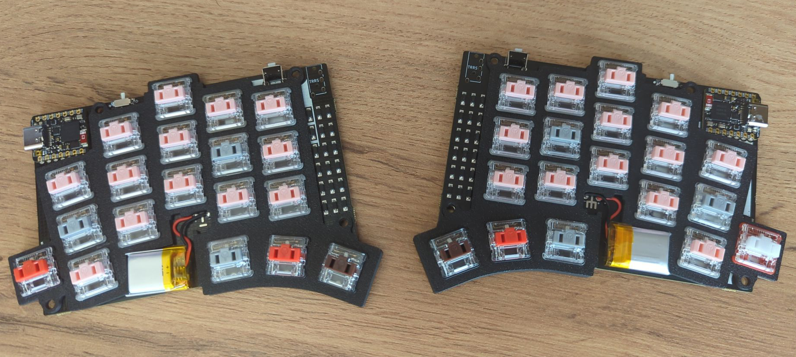

<picture>
  <source media="(prefers-color-scheme: dark)" srcset="/docs/images/TOTEM_logo_dark.svg">
  <source media="(prefers-color-scheme: light)" srcset="/docs/images/TOTEM_logo_bright.svg">
  
</picture>

# ZMK config for the great TOTEM split row-staggered keyboard 

Originally conceived and designed by [GEIST](https://github.com/GEIGEIGEIST)  
Hardware files and the build process guide can be found [here](https://github.com/GEIGEIGEIST/totem)

## My build

I used a replica of the original [Seeed Xiao nRF52840](https://wiki.seeedstudio.com/XIAO_BLE/) just because I already happened to 
have TOTEM keyboard and was willing to experiment somewhat. The replica board
is more than twice as cheap (~$10 at the time of writing).

The default firmware uses standard QWERTY keyboard with Home-Row mods. 
I use neither of those (I use a slightly customized [Graphite](https://github.com/rdavison/graphite-layout) layout, if you're curious) but the firmware is included in the **artifacts** directory
[default firmware](./artifacts/)

### Here's a pic:

## User guide

- fork and clone the repo
- edit the [totem.keymap](./config/totem.keymap) file to match your preferred layout and functionality
- push the changes; this will automatically start the Actions build for the firmware
- download and unzip the resultant artifact (`firmware.zip`)
- connect the board, hit reset twice, mount the device (if not done automatically)
- copy the `.uf2` file (left, right -- pay attention to the file name and use commond sense) onto the device
- depending on the chip (original Xiao vs replica) you may need to wait a bit until it unmounts itself and disappears
    (if it doesn't you most likely have a bootloader issue)
- the Xiao might be finicky with the initial Bluetooth pairing. Here's what I recommend if you're experiencing connectivity and are unable to pair the device:
    - turn off and connect the boards to your machine via USB.
    - upload the [settings_reset-xiao_zmk.uf2](./artifacts/settings_reset-xiao_zmk.uf2) firmware to both.
    - when the device unmounts and disappears, reconnect and remount.
    - flash regular firmware
    - this procedure allows you to start from clean slate. Don't forget to remove the bluetooth connection that may have been saved by your bluetooth daemon
- There's also a GUI/web interface, [ZMK Studio](https://zmk.dev/docs/features/studio), for those who prefer visuals and runtime updates to writing code-like configs and flashing firmware.
This is WIP at the moment but feels free to add it yourself or submit a PR
